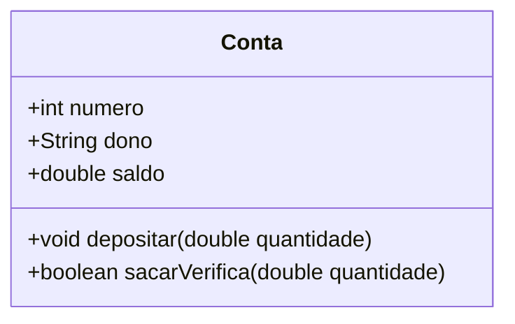

# Aula 04: Introdução à Orientação a Objetos 🚀

## 🎯 Objetivos de Aprendizagem
* Diferenciar os paradigmas Estruturado e Orientado a Objetos.
* Compreender o conceito de Classe como molde e Objeto como instância.
* Implementar métodos com e sem retorno.

## 📖 Conteúdo Teórico

### Paradigmas: O Foco da Solução
Enquanto a programação estruturada foca em **processos** (ações sequenciais sobre dados), a POO foca em **entidades** (objetos que possuem estado e comportamento).

**A Metáfora do Molde:**
Imagine uma forma de bolo (Classe). Ela define o formato e o tamanho, mas não é o bolo em si. O bolo pronto, que você pode comer, é o **Objeto** (Instância).

### Diagrama de Classe Inicial

### 💻 Exemplo de Código: Classe Conta
Este código implementa os conceitos de estado e comportamento em Java, conforme explorado em aula:
```
public class Conta {
    // Atributos (Estado - O que o objeto TEM)
    int numero;
    String dono;
    double saldo;

    // Métodos (Comportamento - O que o objeto FAZ)
    
    // Método sem retorno (void): atualiza o saldo
    void depositar(double quantidade) {
        this.saldo += quantidade;
    }

    // Método com retorno (boolean): executa lógica e devolve resposta
    boolean sacarVerifica(double quantidade) {
        if (quantidade > this.saldo) {
            return false; // Saldo insuficiente
        } else {
            double novoSaldo = this.saldo - quantidade;
            this.saldo = novoSaldo;
            return true; // Operação realizada com sucesso
        }
    }
} ```
```
### 🏋️ Atividade Prática
* Siga o roteiro abaixo para validar o conhecimento:

* Implementação: Crie a classe Conta no seu ambiente (IntelliJ/Eclipse/VS Code).

* Lógica Adicional: No método depositar, adicione uma estrutura de decisão (if) para impedir depósitos de valores negativos.

* Classe de Teste: Crie uma classe Main com o método public static void main(String[] args).

* Instanciação: Crie dois objetos da classe Conta, atribua nomes diferentes aos donos e realize operações de depósito e saque.

* Entrada de Dados: Utilize a classe Scanner para que o usuário interaja com o sistema via console.
  import java.util.Scanner;
```
public class Main {
    public static void main(String[] args) {
        Scanner input = new Scanner(System.in);
        Conta minhaConta = new Conta();
        
        System.out.println("Digite o valor para depósito:");
        double valor = input.nextDouble();
        minhaConta.depositar(valor);
        
        System.out.println("Saldo atual: " + minhaConta.saldo);
    }
}
```
📚 Referências e Leitura Recomendada
DEITEL, Paul J.; DEITEL, H. M. Java: Como Programar. 10ª Edição. Pearson, 2016.

SILVEIRA, Guilherme. Java SE 8 Programmer I. Casa do Código, 2015.

HORSTMANN, Cay S. Core Java. 9ª Edição, 2013.

[⬅️ Voltar ao Início](README.md)
