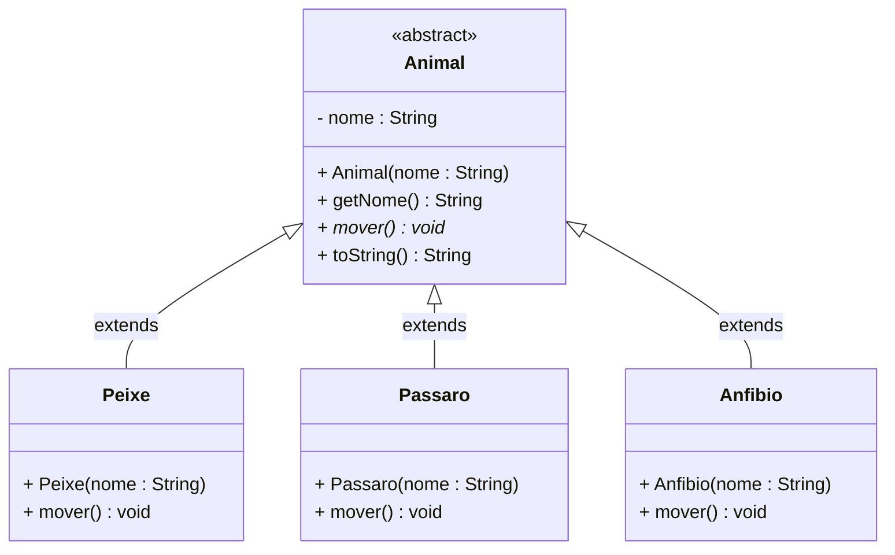
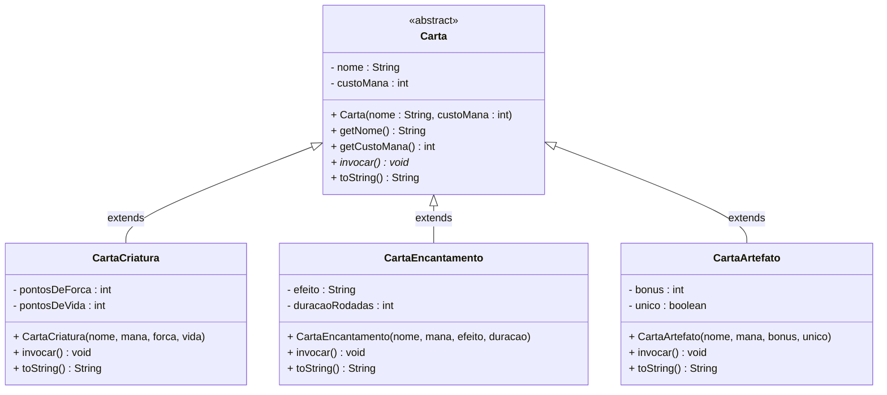

# Aula — Polimorfismo ⚔️🐉

> 📖 Referência: Deitel & Deitel, *Java: Como Programar* (10ª ed.); Horstmann & Cornell, *Core Java* Vol. I

---

## 🎯 Objetivos de Aprendizagem

Ao final desta aula, você será capaz de:

- Explicar o que é **Polimorfismo** e por que ele é um dos pilares da POO
- Usar uma **referência da superclasse** para apontar para objetos de subclasses diferentes
- Compreender que o método executado é decidido em **tempo de execução** (*dynamic dispatch*), não em compilação
- Processar coleções de objetos heterogêneos com um **único loop**, explorando o comportamento polimórfico
- Distinguir **Polimorfismo por sobrescrita** (`@Override`) de **sobrecarga** (`overloading`)
- Aplicar o operador **`instanceof`** para identificar o tipo real de um objeto quando necessário

---

## 1. O Problema que o Polimorfismo Resolve

Você já aprendeu Herança. Com ela, `ContaCorrente` e `ContaPoupanca` reutilizam o código de `ContaBancaria`. Mas um problema novo surge quando o sistema precisa **gerenciar um conjunto misto de objetos**:

```java
// ⚠️ SEM POLIMORFISMO — um bloco de código para cada tipo
ContaCorrente  cc = new ContaCorrente("Ana", 500.0, 1000.0);
ContaPoupanca  cp = new ContaPoupanca("Bruno", 2000.0, 0.006);
ContaBancaria  cb = new ContaBancaria("Carla", 300.0);

// Para atualizar cada conta, precisamos de código separado para cada tipo:
cc.sacar(100.0);
cp.aplicarRendimento();
cb.depositar(50.0);

// E se houver 1000 contas de tipos variados? O código explode em complexidade.
```

O **Polimorfismo** resolve isso elegantemente: permite que uma **única variável** do tipo da superclasse aponte para qualquer objeto de suas subclasses, e que o método correto seja chamado automaticamente conforme o tipo real do objeto.

---

## 2. 📜 Introdução Épica — O Cajado das Múltiplas Formas

Antes da definição técnica, uma metáfora que você não vai mais esquecer.

### A Metáfora do Volante (e do Cajado Mágico)

Imagine que você é um mago com um **Cajado Universal**. Esse cajado possui sempre o mesmo gesto de ataque: você o ergue, pronuncia *"Invocar!"* e algo acontece.

O que acontece, porém, depende do **cristal encaixado** no cajado:

| Cristal no Cajado | Comando | Efeito |
|---|---|---|
| Cristal de Fogo | `invocar()` | Bola de fogo explode no alvo |
| Cristal de Gelo | `invocar()` | Raio congelante paralisa o inimigo |
| Cristal de Cura | `invocar()` | Pulso de energia restaura pontos de vida |

O **gesto** (a interface) é sempre o mesmo. O **efeito** (a implementação) é específico de cada cristal. Você não precisa aprender um gesto diferente para cada tipo de magia — você simplesmente encaixa o cristal certo e usa o cajado.

Isso é exatamente o que acontece no volante de um carro: a **interface** (girar o volante para a direita) é idêntica em todos os modelos. A **implementação interna** pode ser direção hidráulica, elétrica ou mecânica — mas você, o motorista, não precisa saber qual está sendo usada. O comportamento correto acontece automaticamente.

> 🎲 **Nota do Mestre:** Polimorfismo (do grego: *"muitas formas"*) é a qualidade que permite que uma **interface acesse uma classe geral de ações**. A ação específica e determinada para realizar é selecionada em tempo de execução de acordo com o tipo real do objeto.

---

## 3. Polimorfismo — Definição Técnica

**Polimorfismo** é a capacidade de uma variável do tipo da **superclasse** referenciar objetos de **subclasses diferentes**, e de o método invocado ser resolvido dinamicamente de acordo com o tipo real do objeto em tempo de execução.

```java
// Uma variável do tipo SUPERCLASSE aponta para objetos de SUBCLASSES
Animal bicho;

bicho = new Peixe();    // ✅ Peixe É-UM Animal
bicho.mover();          // → chama mover() de Peixe: "Natando..."

bicho = new Passaro();  // ✅ Passaro É-UM Animal
bicho.mover();          // → chama mover() de Passaro: "Voando..."

bicho = new Anfibio();  // ✅ Anfibio É-UM Animal
bicho.mover();          // → chama mover() de Anfibio: "Andando e nadando..."
```

A variável `bicho` não mudou de tipo — continua sendo `Animal`. O que mudou foi o **objeto referenciado**. E a JVM sabe, em tempo de execução, qual implementação de `mover()` chamar. Isso se chama ***dynamic dispatch*** (despacho dinâmico).

---

## 4. 🐉 O Bestiário — A Hierarquia `Animal`

### 4.1 — Diagrama da Hierarquia



### 4.2 — `Animal.java` — A Superclasse

```java
/**
 * Superclasse abstrata que define a estrutura comum
 * a todos os animais do sistema.
 *
 * O método mover() não tem implementação aqui —
 * cada subclasse DEVE fornecer a sua própria versão.
 */
public abstract class Animal {

    private String nome;

    public Animal(String nome) {
        this.nome = nome;
    }

    public String getNome() {
        return nome;
    }

    /**
     * Método polimórfico central: cada subclasse o sobrescreve
     * com o comportamento de movimento específico da sua espécie.
     */
    public abstract void mover();

    @Override
    public String toString() {
        return String.format("[%s] %s", getClass().getSimpleName(), nome);
    }
}
```

> ⚠️ **Aviso de Professora:** `abstract` na superclasse serve para dois propósitos: (1) impede que alguém instancie `new Animal()` diretamente — afinal, um "animal genérico" sem espécie não faz sentido; (2) **força** todas as subclasses a implementar `mover()`, sob pena de erro de compilação. É um contrato obrigatório.

### 4.3 — As Três Criaturas

```java
// Arquivo: Peixe.java
public class Peixe extends Animal {

    public Peixe(String nome) {
        super(nome); // inicializa o nome via construtor de Animal
    }

    @Override
    public void mover() {
        System.out.printf("🐟 %s está natando...%n", getNome());
    }
}
```

```java
// Arquivo: Passaro.java
public class Passaro extends Animal {

    public Passaro(String nome) {
        super(nome);
    }

    @Override
    public void mover() {
        System.out.printf("🐦 %s está voando...%n", getNome());
    }
}
```

```java
// Arquivo: Anfibio.java
public class Anfibio extends Animal {

    public Anfibio(String nome) {
        super(nome);
    }

    @Override
    public void mover() {
        // Anfíbios dominam dois ambientes — a implementação reflete isso
        System.out.printf("🐸 %s está andando... agora nadando...%n", getNome());
    }
}
```

### 4.4 — A Arena: o Array Polimórfico 🏟️

Aqui está o coração do polimorfismo em ação. Um único array do tipo `Animal[]` contém objetos de três subclasses diferentes. Um único loop invoca `mover()` em todos — e cada um responde à sua própria maneira:

```java
// Arquivo: Aula13.java
public class Aula13 {

    public static void main(String[] args) {

        System.out.println("══════════════════════════════════════════");
        System.out.println("   A ARENA — MOVIMENTO DAS CRIATURAS      ");
        System.out.println("══════════════════════════════════════════\n");

        // Array polimórfico: o tipo declarado é Animal,
        // mas cada posição guarda um objeto de uma subclasse diferente
        Animal[] criaturas = new Animal[3];
        criaturas[0] = new Peixe("Nemo");          // Peixe  É-UM Animal ✅
        criaturas[1] = new Passaro("Tico");         // Passaro É-UM Animal ✅
        criaturas[2] = new Anfibio("Kermit");       // Anfibio É-UM Animal ✅

        // Um único loop — três comportamentos diferentes
        // A JVM decide EM TEMPO DE EXECUÇÃO qual mover() chamar
        for (Animal a : criaturas) {
            System.out.print(a + " → ");
            a.mover(); // ← dynamic dispatch: o tipo real determina qual método é chamado
        }

        System.out.println();

        // Adicionando uma nova mensagem (enviada polimorficamente a cada objeto)
        System.out.println("── Enviando a mesma mensagem a todas as criaturas ──");
        for (Animal a : criaturas) {
            a.mover(); // mesma instrução, comportamentos completamente distintos
        }
    }
}
```

**Saída esperada:**
```
══════════════════════════════════════════
   A ARENA — MOVIMENTO DAS CRIATURAS
══════════════════════════════════════════

[Peixe] Nemo → 🐟 Nemo está natando...
[Passaro] Tico → 🐦 Tico está voando...
[Anfibio] Kermit → 🐸 Kermit está andando... agora nadando...

── Enviando a mesma mensagem a todas as criaturas ──
🐟 Nemo está natando...
🐦 Tico está voando...
🐸 Kermit está andando... agora nadando...
```

> 💡 **Dica:** Note que o código do loop `for` **não precisa ser alterado** quando você adiciona uma nova subclasse. Se amanhã aparecer `new Cobra("Kaa")` com seu próprio `mover()`, basta adicioná-la ao array — o loop já funciona. Esse é o **Princípio Aberto/Fechado**: aberto para extensão, fechado para modificação.

---

## 5. 📖 O Grimório Expandido — O Baralho Mágico

Agora vamos construir do zero uma segunda hierarquia polimórfica: um **sistema de cartas mágicas**. Cada carta compartilha a mesma interface (`invocar()`), mas o efeito é completamente diferente dependendo do tipo.

### 5.1 — Diagrama da Hierarquia



### 5.2 — `Carta.java` — A Superclasse Abstrata

```java
/**
 * Superclasse abstrata que representa qualquer carta de um baralho mágico.
 * Toda carta tem nome, custo de mana e sabe ser invocada —
 * mas o efeito da invocação é específico de cada tipo.
 */
public abstract class Carta {

    private String nome;
    private int    custoMana;

    public Carta(String nome, int custoMana) {
        this.nome      = nome;
        this.custoMana = (custoMana >= 0) ? custoMana : 0;
    }

    public String getNome()      { return nome; }
    public int    getCustoMana() { return custoMana; }

    /**
     * Método polimórfico central: cada subclasse define seu efeito de invocação.
     */
    public abstract void invocar();

    @Override
    public String toString() {
        return String.format("╔ %-22s [%d✦] ╗", nome, custoMana);
    }
}
```

### 5.3 — As Três Subclasses de Carta

```java
// Arquivo: CartaCriatura.java
/**
 * Representa uma criatura invocável ao campo de batalha.
 * Sua invocação entra com atributos de força e vida.
 */
public class CartaCriatura extends Carta {

    private int pontosDeForca;
    private int pontosDeVida;

    public CartaCriatura(String nome, int custoMana,
                         int pontosDeForca, int pontosDeVida) {
        super(nome, custoMana);
        this.pontosDeForca = pontosDeForca;
        this.pontosDeVida  = pontosDeVida;
    }

    @Override
    public void invocar() {
        System.out.printf("⚔️  CRIATURA INVOCADA: %s entra em batalha! [%d/%d]%n",
                          getNome(), pontosDeForca, pontosDeVida);
    }

    @Override
    public String toString() {
        return super.toString()
             + String.format("%n║  CRIATURA  %d/%-17d ║", pontosDeForca, pontosDeVida);
    }
}
```

```java
// Arquivo: CartaEncantamento.java
/**
 * Representa um feitiço contínuo que persiste por um número de rodadas.
 * Sua invocação aplica um efeito de campo duradouro.
 */
public class CartaEncantamento extends Carta {

    private String efeito;
    private int    duracaoRodadas;

    public CartaEncantamento(String nome, int custoMana,
                             String efeito, int duracaoRodadas) {
        super(nome, custoMana);
        this.efeito         = efeito;
        this.duracaoRodadas = (duracaoRodadas > 0) ? duracaoRodadas : 1;
    }

    @Override
    public void invocar() {
        System.out.printf("✨ ENCANTAMENTO ATIVADO: %s → '%s' por %d rodadas!%n",
                          getNome(), efeito, duracaoRodadas);
    }

    @Override
    public String toString() {
        return super.toString()
             + String.format("%n║  ENCANTO  %-20s ║", efeito);
    }
}
```

```java
// Arquivo: CartaArtefato.java
/**
 * Representa um objeto mágico equipável.
 * Artefatos únicos só podem existir uma vez no campo de batalha.
 */
public class CartaArtefato extends Carta {

    private int     bonus;
    private boolean unico; // true = lendário: só pode ter 1 no campo

    public CartaArtefato(String nome, int custoMana, int bonus, boolean unico) {
        super(nome, custoMana);
        this.bonus = bonus;
        this.unico = unico;
    }

    @Override
    public void invocar() {
        String raridade = unico ? "🌟 [LENDÁRIO]" : "[COMUM]";
        System.out.printf("🔮 ARTEFATO EQUIPADO: %s %s — concede +%d de bônus!%n",
                          getNome(), raridade, bonus);
    }

    @Override
    public String toString() {
        return super.toString()
             + String.format("%n║  ARTEFATO  +%-3d %-16s ║",
                             bonus, unico ? "[LENDÁRIO]" : "");
    }
}
```

### 5.4 — `Baralho.java` — O Loop Polimórfico 🃏

```java
import java.util.ArrayList;
import java.util.List;

/**
 * Demonstra o polimorfismo através de um baralho heterogêneo:
 * um único loop invoca todos os tipos de cartas, cada uma com
 * seu efeito próprio, sem nenhum if/switch para distingui-las.
 */
public class Baralho {

    public static void main(String[] args) {

        System.out.println("╔══════════════════════════════════════╗");
        System.out.println("║      ⚔️  INVOCAR BARALHO COMPLETO  ⚔️  ║");
        System.out.println("╚══════════════════════════════════════╝\n");

        // List<Carta> aceita qualquer subclasse — o tipo declarado é Carta
        List<Carta> deck = new ArrayList<>();

        deck.add(new CartaCriatura("Dragão das Sombras",  7, 6, 5));
        deck.add(new CartaEncantamento("Névoa Arcana",    3, "Invisibilidade", 3));
        deck.add(new CartaArtefato("Espada da Aurora",    4, 3, true));
        deck.add(new CartaCriatura("Elemental de Fogo",   4, 3, 3));
        deck.add(new CartaEncantamento("Maldição Antiga", 5, "Medo Constante", 5));
        deck.add(new CartaArtefato("Amuleto Protetor",    2, 1, false));

        System.out.println("── Jogando o deck ──────────────────────\n");

        int totalMana = 0;

        // Um único for-each — polimorfismo garante o comportamento correto
        // sem nenhum instanceof ou if para identificar o tipo
        for (Carta carta : deck) {
            carta.invocar();              // dynamic dispatch em ação
            totalMana += carta.getCustoMana();
        }

        System.out.println();
        System.out.printf("✦ Total de mana consumido nesta jogada: %d✦%n%n", totalMana);

        // ── Exibindo as cartas formatadas ─────────────────────────────────
        System.out.println("── Cartas do Deck ──────────────────────");
        for (Carta carta : deck) {
            System.out.println(carta);    // toString() polimórfico
        }
    }
}
```

**Saída esperada:**
```
╔══════════════════════════════════════╗
║      ⚔️  INVOCAR BARALHO COMPLETO  ⚔️  ║
╚══════════════════════════════════════╝

── Jogando o deck ──────────────────────

⚔️  CRIATURA INVOCADA: Dragão das Sombras entra em batalha! [6/5]
✨ ENCANTAMENTO ATIVADO: Névoa Arcana → 'Invisibilidade' por 3 rodadas!
🔮 ARTEFATO EQUIPADO: Espada da Aurora 🌟 [LENDÁRIO] — concede +3 de bônus!
⚔️  CRIATURA INVOCADA: Elemental de Fogo entra em batalha! [3/3]
✨ ENCANTAMENTO ATIVADO: Maldição Antiga → 'Medo Constante' por 5 rodadas!
🔮 ARTEFATO EQUIPADO: Amuleto Protetor [COMUM] — concede +1 de bônus!

✦ Total de mana consumido nesta jogada: 25✦

── Cartas do Deck ──────────────────────
╔ Dragão das Sombras     [7✦] ╗
║  CRIATURA  6/5               ║
╔ Névoa Arcana           [3✦] ╗
║  ENCANTO  Invisibilidade      ║
...
```

> 💡 **Dica:** Veja que o `for` do `Baralho` nunca usa `if (carta instanceof CartaCriatura)`. Isso é design polimórfico correto. Se amanhã você criar `CartaFeitico`, basta adicioná-la ao deck — o loop já a processa. Código que precisa de `instanceof` para decidir comportamento geralmente indica que o polimorfismo não foi aplicado.

---

## 6. Polimorfismo vs. Sobrecarga — Cuidado com a Confusão

Dois conceitos frequentemente confundidos:

| Característica | **Polimorfismo** (Sobrescrita) | **Sobrecarga** (*Overloading*) |
|---|---|---|
| Onde ocorre | Entre **superclasse e subclasse** | Na **mesma classe** |
| O que muda | A **implementação** do método | A **assinatura** (parâmetros) |
| Palavra-chave | `@Override` | Sem anotação especial |
| Quando é resolvido | **Tempo de execução** (JVM decide) | **Tempo de compilação** (compilador decide) |
| Exemplo | `Peixe.mover()` vs. `Passaro.mover()` | `println(int)` vs. `println(String)` |

```java
// SOBRESCRITA (Polimorfismo) — mesma assinatura, classes diferentes
class Animal   { void mover() { System.out.println("..."); } }
class Peixe extends Animal {
    @Override
    void mover() { System.out.println("Natando"); } // mesma assinatura
}

// SOBRECARGA — mesma classe, assinaturas diferentes
class Calculadora {
    int somar(int a, int b)       { return a + b; }
    double somar(double a, double b) { return a + b; } // parâmetros diferentes
}
```

---

## 7. O Operador `instanceof` — Identificando a Criatura no Escuro

Embora o bom design polimórfico evite `instanceof`, há casos legítimos onde precisamos identificar o tipo real de um objeto — por exemplo, para acessar métodos exclusivos de uma subclasse:

```java
for (Carta carta : deck) {
    carta.invocar(); // polimórfico — sem instanceof necessário

    // Caso especial: ação exclusiva de criaturas (método não existe em Carta)
    if (carta instanceof CartaCriatura criatura) { // Java 16+ pattern matching
        System.out.printf("   → Poder de ataque: %d%n",
                          criatura.getPontosDeForca());
    }
}
```

> ⚠️ **Aviso de Professora:** O uso de `instanceof` para decidir *comportamento* (o que o objeto faz) é um sinal de que o polimorfismo não foi bem aplicado — mova esse comportamento para dentro de um método sobrescrito. O uso de `instanceof` para acessar *membros exclusivos* de uma subclasse é legítimo e necessário.

---

## 8. ⚔️ As Provações do Herói — Exercícios Práticos

### 📜 Exercício Obrigatório — Sistema Bancário Revisitado

*Fonte: Material original da Profa. Juliana Costa-Silva*

Recrie o sistema bancário incorporando o Polimorfismo completo:

**Estrutura de classes:**
- `Conta` — superclasse com atributos `saldo`, métodos `get`/`set` para cada atributo, e método `depositar`, `sacar` e `toString`
- `ContaCorrente extends Conta` — adiciona método `atualizar(double taxa)` que debita `saldo * taxa` como tarifa
- `ContaPoupanca extends Conta` — seu `atualizar(double taxa)` **credita** `saldo * taxa` como rendimento

**Requisitos:**
- Crie um array `Conta[] contas` com instâncias de ambas as subclasses
- Crie um método estático `void atualizarTodas(Conta[] contas, double taxa)` que percorre o array e chama `atualizar(taxa)` em cada conta — observe que o comportamento correto ocorre automaticamente (débito na corrente, crédito na poupança)
- Em `main`, instancie duas contas de cada tipo, chame `atualizarTodas` e exiba o extrato final de todas as contas com `toString()`

> 💡 **Dica do Mestre:** O método `atualizarTodas` recebe `Conta[]` — ele não sabe se está lidando com correntes ou poupanças. Ele apenas envia a mensagem `atualizar()`. A JVM cuida do resto. Esse é o poder que você está treinando.

---

### 🗡️ Nível 1 — A Batalha dos Personagens

Crie um sistema de personagens para um RPG de mesa:

**Superclasse abstrata `Personagem`:**
- Atributos: `nome` (String), `pontosDeVida` (int), `nivel` (int)
- Método abstrato: `atacar()` — exibe o tipo e o dano do ataque
- Método concreto: `receberDano(int dano)` — reduz `pontosDeVida`, impede que fique negativo
- Método concreto: `estaVivo()` — retorna `true` se `pontosDeVida > 0`
- `toString()` — exibe nome, nível e pontos de vida formatados

**Subclasses:**
- `Guerreiro` — `atacar()` exibe golpe físico com dano baseado em `nivel * 5`
- `Mago` — `atacar()` exibe feitiço arcano com dano baseado em `nivel * 8` mas tem 30% de chance de errar (`Math.random() < 0.3`)
- `Arqueiro` — `atacar()` dispara flecha com dano `nivel * 6`; a cada 3 ataques, aciona um acerto crítico que dobra o dano (use um contador de instância)

**Em `Arena.java`:**
- Crie um `ArrayList<Personagem>` com pelo menos 2 de cada tipo
- Simule 3 rodadas de batalha: em cada rodada, todos os personagens que ainda estão vivos (`estaVivo()`) atacam
- Ao final, exiba os sobreviventes

---

### 🐉 Nível 2 — Desafio do Chefe: A Loja de Itens Mágicos

Construa um sistema completo de loja de itens mágicos com cálculo polimórfico de preços:

**Superclasse abstrata `ItemMagico`:**
- Atributos: `nome` (String), `precoBase` (double), `raridade` (String — `"Comum"`, `"Raro"`, `"Lendário"`)
- Método abstrato: `calcularPrecoFinal()` — cada tipo de item aplica seu próprio cálculo de imposto/bônus
- Método abstrato: `descrever()` — exibe a ficha completa do item
- Método concreto: `getNome()`, `getPrecoBase()`, `getRaridade()`
- `toString()` — exibe nome e preço final formatado

**Subclasses com lógica exclusiva:**

`Pocao extends ItemMagico`
- Atributo exclusivo: `efeito` (String) — ex: "Cura", "Força", "Velocidade"
- `calcularPrecoFinal()` → `precoBase * 1.1` (10% de imposto de consumo)
- `descrever()` → exibe nome, efeito e preço final

`Arma extends ItemMagico`
- Atributos exclusivos: `tipoDano` (String), `bonusDano` (int)
- `calcularPrecoFinal()` → `precoBase * 1.25 + (bonusDano * 50)` (25% imposto + valor do bônus)
- `descrever()` → exibe nome, tipo de dano, bônus e preço final

`Pergaminho extends ItemMagico`
- Atributo exclusivo: `feitico` (String), `nivelMagico` (int)
- `calcularPrecoFinal()` → `precoBase * (1 + nivelMagico * 0.15)` (15% por nível mágico)
- `descrever()` → exibe nome, feitiço, nível mágico e preço final

**Em `Loja.java`:**
- Crie um `List<ItemMagico>` com ao menos 2 de cada tipo
- Implemente um método `static void exibirVitrine(List<ItemMagico> estoque)` que imprime o catálogo chamando `descrever()` polimorficamente
- Implemente `static double calcularValorTotalEstoque(List<ItemMagico> estoque)` que soma `calcularPrecoFinal()` de todos os itens
- Implemente `static List<ItemMagico> filtrarPorRaridade(List<ItemMagico> estoque, String raridade)` que retorna apenas itens de uma raridade específica (use `instanceof` para verificar se é necessário — ou repense o design e evite-o)
- No `main`, demonstre os três métodos e exiba o valor total do estoque

**Saída esperada parcial:**
```
╔══════════════════════════════════════════╗
║        🏪 LOJA DE ITENS MÁGICOS 🏪        ║
╚══════════════════════════════════════════╝

🧪 Poção de Cura Maior [Raro]
   Efeito    : Cura
   Preço Base: R$  45,00 → Final: R$  49,50

⚔️  Espada do Crepúsculo [Lendário]
   Dano      : Físico | Bônus: +8
   Preço Base: R$ 200,00 → Final: R$ 650,00

📜 Pergaminho de Bola de Fogo [Comum]
   Feitiço   : Bola de Fogo | Nível: 3
   Preço Base: R$  80,00 → Final: R$ 116,00

──────────────────────────────────────────
✦ Valor total do estoque: R$ 1.234,50
```

---

## 9. Polimorfismo no Ecossistema Java

O polimorfismo não é apenas um conceito do seu código — é a base de toda a plataforma Java:

| Exemplo na JDK | Como o polimorfismo aparece |
|---|---|
| `System.out.println(objeto)` | Chama `toString()` polimorficamente — cada tipo exibe o que sobrescreveu |
| `Collections.sort(lista)` | Chama `compareTo()` definido em cada elemento — funciona com qualquer tipo |
| `List<Animal> lista` | `ArrayList`, `LinkedList` ou qualquer implementação de `List` pode ser usada |
| Tratamento de exceções `catch(Exception e)` | Captura `IOException`, `NullPointerException` — todas são `Exception` |

---

## 10. Onde Esta Aula se Encaixa no Semestre

```
Aula 04 — Classes e Objetos
│   "Sei criar entidades com estado e comportamento"
│
Aula 05 — Encapsulamento
│   "Sei proteger o estado dos meus objetos"
│
Aula 06 — Construtores e Herança
│   "Sei construir hierarquias reutilizáveis"
│
Aula 07 — Polimorfismo ← Você está aqui ▼
│   "Uma interface, muitos comportamentos —
│    o mesmo código processa tipos diferentes"
│
▼ Próximas Aulas: Classes Abstratas e Interfaces
    "Sei definir contratos sem implementação
     e construir sistemas verdadeiramente extensíveis"
```

---

## 📚 Referências e Leituras Recomendadas

| Recurso | Capítulos | Relevância |
|---|---|---|
| Deitel & Deitel — *Java: Como Programar* (10ª ed.) | Cap. 10 (Polimorfismo e Interfaces) — seções 10.1–10.5 | ⭐⭐⭐ Essencial |
| Horstmann & Cornell — *Core Java* Vol. I | Cap. 5.2 (Polymorphism) e Cap. 5.3 (Dynamic Binding) | ⭐⭐⭐ Essencial |
| Silveira & Amaral — *Java SE 8 Programmer I* | Cap. 7 (Polimorfismo e Casting) | ⭐⭐ Recomendado |
| Oracle — [Java Tutorials: Polymorphism](https://docs.oracle.com/javase/tutorial/java/IandI/polymorphism.html) | — | ⭐⭐ Recomendado |

---

## 🚀 Próximos Passos

- Estudar **classes abstratas** em profundidade: quando e por que tornar uma classe não-instanciável
- Explorar **interfaces** como o mecanismo de polimorfismo mais flexível do Java — uma classe pode implementar múltiplas interfaces, superando a limitação da herança simples
- Praticar o padrão de design **Strategy**, que é polimorfismo aplicado à troca de algoritmos em tempo de execução

---

*[README — Página Inicial](README.md) ·
